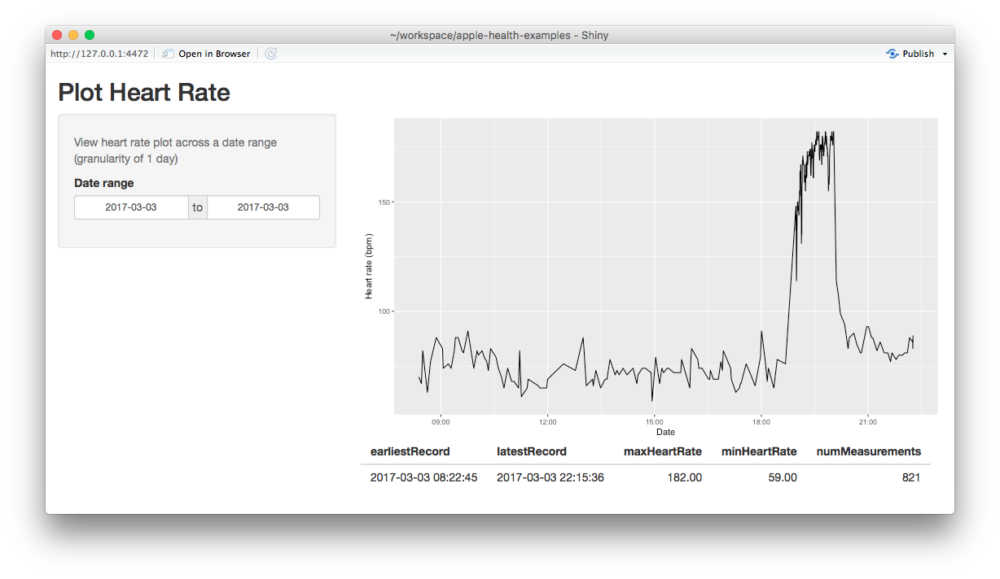

# Apple Health Data Analysis Examples

This repo contains some example scripts that use Apple Health data to produce
visualizations and reports.

## Prerequisites

Use the
[apple-health-exporter](https://github.com/mganjoo/apple-health-exporter)
script to produce a dump of Apple Health data in this directory named
`data.feather`. All scripts rely on the data being present in this directory
**under this exact name**.

To run the Shiny apps included here, import the `shiny` library.

```r
library(shiny)
runApp("plotHeartRate.R")
```

## Examples

* `plotHeartRate.R`: Creates an interactive time series plot of heart rate
  data.  Adapted from [Jeff Johnston](https://github.com/jeffjjohnston)'s
  [excellent walkthrough](https://jeffjjohnston.github.io/rstudio/rmarkdown/2016/04/28/explore-your-apple-watch-heart-rate-data.html).

  
